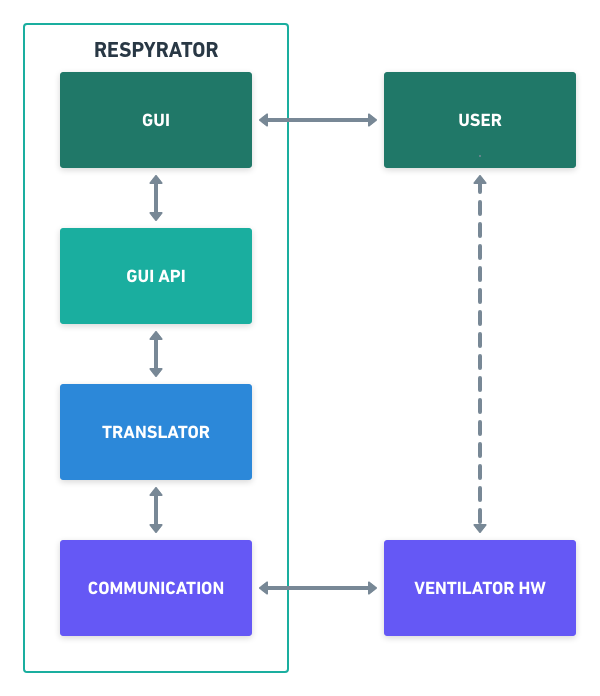

# Respyrator

Desarrollo Software Python para ventiladores mecánicos.

Debido a la alta demanda y la variabilidad en las implementaciones de los diferentes tipos de ventiladores mecánicos en desarrollo, este proyecto trata de ser un pegamento para ser usado por todos ellos. Consiste en cuatro capas o componentes.

| Capa | Función |
| :-: | :- |
| GUI | -  Usable, sencilla y **configurable**. -  Enfocada para pantallas táctites, pero es adaptable a control por teclas. |
| GUI API | - Forma estandar de mandar y recibir información de la GUI. |
| Translator | - Traduce los bytes recibidos del ventilador. - Empaqueta en bytes la información para enviar al ventilador. |
| Communication | - Encargada de recibir - mandar datos.por la conexión que se tenga con el ventilador. - La conexión en principio puede ser USB. |

Cada una de las capas es configurable y además sustituible por alguna otra que tu quieras. Ejemplo:

- Si no te sirve nuestra GUI y prefieres crear tu una, la comunicas con la GUI API y configuras las opciones de funcionamiento que permite la pantalla.
- Si tu ventilador tiene una conexión Ethernet, creas tu modulo de comunicación, lo conectas con el Translator y lo configuras para indicarle como se lee los datos, y como los empaquetas para ser mandada.

S estas interesado en saber más sobre Respyrator, te aconsejamos que primero leas la información que hemos dejado sobre los Ventiladores Mecánicos. Luego la información de Respyrator. Si quieres probarlo, mira la sección de uso. Para poder modificar o contribuir al proyecto, leete por favor como se contribuye al proyecto.

- [Sobre el proyecto](about.md)
- [Ventilación Mecánica]()
- [Respyrator]()
- [Como usarlo]()
- [Como colaborar](colaborar/colaborar.md)
