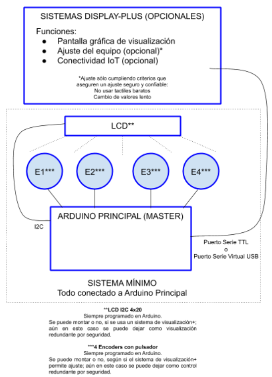

# Requisitos

Los requisitos del proyecto son un documento vivo que se encuentra -> [en este enlace](https://docs.google.com/document/d/1lItbWZhYFjCUJKEzwG3V0N3ZbFNCW4r7WvXlSnQcjlk/edit?usp=sharing)

Todo lo que viene más adelante es un resumen un poco más ordenado, pero que puede estar desactualizado respecto al oficial.

## Respirador asistido, que es y como funciona

Un respirador es una máquina que ayuda a respirar a un paciente de manera controlada. Consiste en un tubo que se introduce por la garganta hasta la traquea. Por este tubo se bombea aire y también se extrae el CO$_2$. Hay diferentes modos de ventilzación: esperar que el paciente pida aire, hacerlo programado, etc.

Su configuración, así como su control, suele estar a cargo de l@s anestesistas y/o intensivistas en los quirófanos. O también puede ser manipulado por enfermer@s en la zona de rehabilitación.

Antes de saber avanzar más, te recomiendo que leas [esta página](http://enfermeroenurgencias.blogspot.com/2015/11/parametros-del-respirador-programar.html) donde se explican los distintos parámetros y modos de un respirador.

## Proyecto

El proyecto consiste en desarrollar realizar toda la parte software de adquisición y visualización de datos, así como configuración de un respirador automático Open Source desarrollado por la comunidad maker junto con la HUCA. Todo esto va sobre un pc comunicado con el respirador a través de una conexión USB (serial).

El respirador consiste en:

- Una MCU basada en un Arduino Mega.
- Comunicación con sensores a través de SPI.
- Conexión serie (USB) a través del Serial (Serial0) del Mega para poder mandar y recibir datos.
- Un display LCD conectado por I2C con el que se interacciona por ahora y que se puede dejar a modo de información redundante.

Se debe de desarrollar:

- Lectura datos por la conexión serial.
- Crear un dashboard con los datos de los parámetros, así como la información del paciente.
- Poder modificar parámetros a través del interfaz gráfico.
- Mandar parámetros por la conexión serial.

## Conexión Serie

La conexión serie se hace siguendo los parámetros, 115200/8-N-1, es decir:

- Baud rate 115200
- Byte size 8
- Parity None
- Stopbits 1

El respirador manda datos de lectura de los sensores, y también se le pueden mandar datos poder cambiar la configuracion:

- [Leer datos del respirador](tx.md)
- [Mandar datos al respirador](rx.md)

## Visualización de datos

TODO: