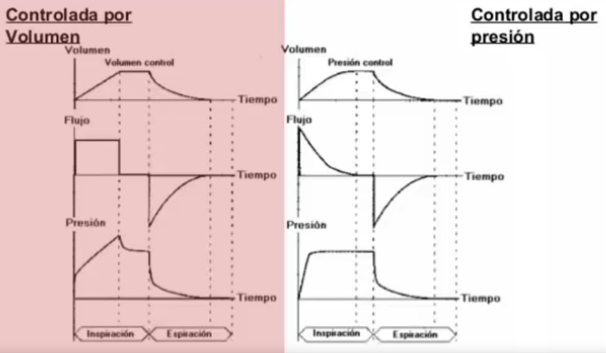

# Gráficas

Para monitorizar al paciente, la manera más rápida de ver su comportamiento es a través de gráficas. Básicamente se usan tres gráficas, aunque solo las dos primeras son indispensables:

- Presión.
- Flujo.
- Volumen.

Estas gráficas varían sobre todo si el modo es controlado por presión o por volumen. Aquí se puede ver un ejemplo de las gráficas de lo que decimos.

