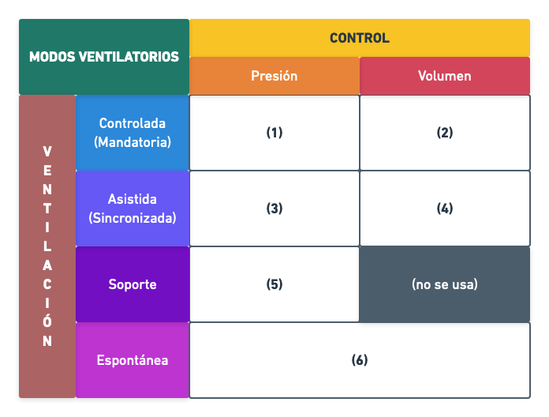

# Modos ventilatorios

Estos modos se generan a partir de dos dimensiones: ventilaciones y tipo de control.

## Ventilaciones

Existen 4 tipos de ventilaciones.

| Ventilación | Funcionamiento |
| :-: | :- |
| Controlada o Mandatoria | - El ventilador es activo. - Funciona de manera fija sin tener en cuenta al paciente. - Manda el ventilador. - Estos modos son típicos de ventiladores quizás más antigüos o rudimentarios. |
| Asistida o Sincronizada | - El ventilador es reactivo. - Funciona como en la ventilación control, manda el ventilador, pero tiene un feedback por parte del paciente para iniciarse. - Son los más usádos para pacientes sedados. |
| Soporte | - El ventilador es supervisor. - Ahora manda el paciente, pero el ventilador supervisa que su ventilación llegue a unos mínimos criterios de calidad. |
| Espontánea | - El ventilador es pasivo. - El paciente respira por si solo, pero el aire en vez de venir del ambiente, viene directamente del ventilador. - Básicamente se controla la calidad del aire y poco más. |

## Tipos de Control

El control se refiere a tener una magnitud / parámetro / criterio que se debe de mantener constante. En este caso solo existen dos:

- **Control por Presión**
- **Control por Volumen**

## Modos

Uno de los mayores problemas encontrados es que cada fabricante llama a cada modo de una forma distinta. Es probable que incluso por cada ventilador pueda ofrecer distintos sub-modos dentro de algún modo. Este proyecto se va a centrar solo los modos principales, nombrandolos por su definición **ventilación-control**, en lugar de por un nombre que acabe llevando a confusión.

La combinación **ventilación-control** da como resultado 8 modos. En la realidad solo hay 6 modos:

- Cuando la ventilación es espontánea el control no influye, luego esos dos 2 se fusionan en 1.
- En la ventilación soporte el control por volumen no se usa.

En cada modo hay que configurar los parámetros de control y los parámetros que puedan dar alarma.
