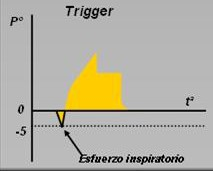

# Parámetros de Ventilación Asistida

En la ventilación asistida se tiene un mecanismo de feedback o sincronía con el paciente. El ventilador funciona según su configuración, pero tiene esta información para iniciar la inspiración.

| Parámetro | Siglas | Unidades | Valor por defecto | Mínimo | Máximo | Incremento ±∆ |
| :- | :-: | :-: | :-: | :-: | :-: | :-: |
| Trigger de presión | trigger | cmH$_2$O | -2.0 | -3.0 | -0.5 | 0.1 |
| Trigger de flujo | trigger | L/min | -2.0 | -4.0 | -0.2 | 0.1 |
| Rampa | ramp | mseg | 50 | 0 | 200 | 50 |

## Triggers

!!! tip "Existen 3 triggers"
    En realidad existen 3 triggers: presión, flujo y **tiempo**. Pero este último se fija con FR-T$_{insp}$ en las ventilaciones control y asistida.

- Su siglas son **trigger**.
- El feedback del paciente se puede recoger a través de la presión o del flujo.
- Este parámetro es la sensibilidad de ese feedback para que se dispare (inicie) el ciclo respiratorio.
- Es un valor negativo, ya que es el paciente el que está haciendo un **esfuerzo respiratorio** para iniciar la inspiración.

!!! warning "El trigger no manda sobre los otros parámetros"
    Es probable que a veces no se llegue al valor del trigger para dispararse.

    O que se haga, pero eso incumpla algún parámetro como la FR.

    En esos casos, es el ventilador el que regula.

    El trigger es solo una ayuda para hacer mas natural la ventilación, pero si el paciente "falla", el ventilador prioriza sus parámetros (como la FR) antes que el trigger.

## Rampa

- Su siglas son **ramp**.
- Es el tiempo que va a tardar en introducirse el aire "de manera efectiva" en el paciente.
- Es decir, cuando tiempo tarda en obtener un valor positivo en **presión-flujo-volumen**.
