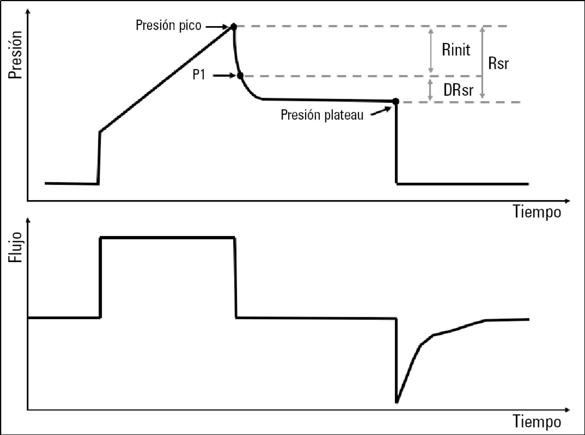

# Parámetros de Presión

La presión es una magnitud física que, para entendernos, se refiere a la fuerza con la que se introduce el aire en el paciente. Si el control se hace por presión, esta será prácticamente constante cuando se inspira. En cambio cuando el control es por volumen, su compartamiento dinámica es como el que se observa en la imagen siguiente:

1. La presión crece hasta un pico mientras se inspira.
2. Luego hay un tiempo de relajación (plateau o meseta).
3. Por último en la espiración, la presión cae hasta un valor definido.

Se adjunta una tabla con los parámetros y su información. 

| Parámetro | Siglas | Unidades | Valor por defecto | Mínimo | Máximo | Incremento ±∆ |
| :- | :-: | :-: | :-: | :-: | :-: | :-: |
| Presión inspiratoria | P$_{insp}$ o P | cmH$_2$O | 18 | 4 | 60 | 1 |
| Presión Pico | P$_{pk}$ o PIP | cmH$_2$O |  |  |  |  |
| Presión Positiva al Final de la Espiración | PEEP | cmH$_2$O | 5 | 0 | 30 | 1 |
| Presión Plateau | P$_{plt}$ o P$_{mes}$ | cmH$_2$O |  |  |  |  |

!!! warning "Nota para todas las tablas de parámetros"
    Los parámetros que no tienen valores definidos, es que no son parámetros editables en el ventilador. Son solo parámetros de lectura.

## Presión inspiratoria (o Presión)

- Su siglas son **P$_{insp}$** o **P**.
- Es la presión con la que se inserta aire en el paciente.

!!! tip "Control por volumen"
    Cuando el ventilador se controla por presión, Presión inspiratoria y la Presión pico son el mismo parámetro.

    P$_{insp}$ = P$_{pk}$

## Presión pico (o Presión Inspiratoria Pico)

- Su siglas son **P$_{pk}$** o **PIP**.
- Es la máxima presión que se alcanza en la inspiración.
- No es un parámetro editble.

## Presión Positiva al Final de la Espiración

- Su siglas son **PEEP**.
- Es la presión de aire con la que se dejan los alvéolos al final de la espiración para que no se acaben desinflando.
- Esto se hace para que el alveolo no sufra ni se colapse.

## Presión Plateau (o Presión meseta teleinspiratoria)

- Su siglas son **P$_{plt}$** o **P$_{mes}$**.
- Esta presión se observa cuando el control se hace por volumen.
- Después de inspirar hay un tiempo de reposo antes de espirar.
- En este tiempo de reposo, la baja presión baja, pero muy lentamente, se mantiene casi constante.
- En la gráfica se observa una "meseta", por eso el nombre de tiempo y presión meseta (o plateau).
- No es un parámetro editable.
