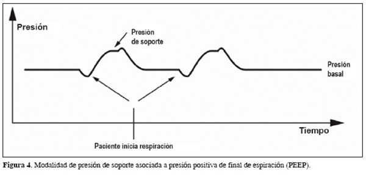

# Parámetros de Ventilación Soporte

TODO: **Faltan datos por completar**

En la ventilación soporte, el paciente es el que manda, es decir, respira solo, pero bajo la supervisión del ventilador.

| Parámetro | Siglas | Unidades | Valor por defecto | Mínimo | Máximo | Incremento ±∆ |
| :- | :-: | :-: | :-: | :-: | :-: | :-: |
| Presión soporte | **falta** | cmH$_2$O | **falta** | **falta** | **falta** | **falta** |

## Presión soporte

- Su siglas son **falta**.
- Es una presión que se ejerce para que el paciente alcance unos criterios en la respiración.

