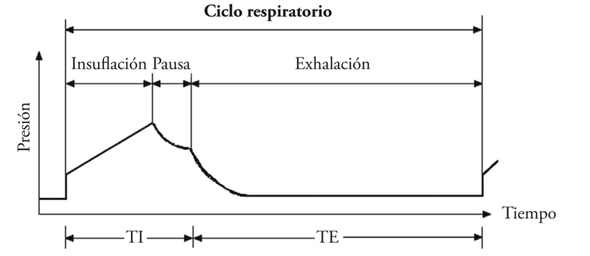

# Parámetros de Tiempo

La respiración o ciclo respiratorio se divide en dos partes:

1. Tiempo de inspiración = Tiempo de insuflación + Tiempo plateau.
    - Es cuando se inspira / inhala.
    - Primero se insufla aire.
    - Luego se espera un tiempo (plateau-meseta-pausa) que se relajen los pulmones y acabe de entrar el aire a los alvéolos.
2. Tiempo de espiración.
    - Es cuando se espira / exhala.

Así que los parámetros de tiempo tienen que ver tanto con la cantidad de ciclos respiratorios en un tiempo determinado (frecuencia), así como son esos ciclos respiratorios.

| Parámetro | Siglas | Unidades | Valor por defecto | Mínimo | Máximo | Incremento ±∆ |
| :- | :-: | :-: | :-: | :-: | :-: | :-: |
| Frecuencia Respiratoria | FR o f$_r$ | 1/min | 15 | 6 | 35 | 1 |
| Tiempo inspiratorio | T$_{insp}$ | seg | 1.33 | 0.5 | 5 | 0.01 |
| Relación Inspiración:Espiración | I:E |  | 1:2 |  |  |  |

## Frecuencia Respiratoria por minuto (o Frecuencia)

- Su siglas son **FR** o **f$_r$**.
- Es la cantidad de ciclos respiratorios por minuto que tiene que hacer el paciente.

## Tiempo de inspiración

- Su siglas son **T$_{insp}$**.
- Es el tiempo que dura la inspiración, que es el tiempo de insuflar aire + tiempo plateau (cuando se están expandiendo los alvéolos).

## Relación Inspiración:Espiración

- Su siglas son **I:E**.
- Es la relación en proporción que existe entre el tiempo de inspiración y el tiempo de expiración.
- No se suele configurar el tiempo de expiración directamente, sino que se configura a través del T$_{insp}$ y la I:**E**.
- La I será 1 y solo cambia la E.

!!! info "Relación entre FR - T$_{insp}$ - I:E"
    $$\frac{60}{FR} = T_{insp} + T_{esp}$$

    $$T_{esp} = \frac{60}{FR} - T_{insp}$$

    $$I:E = 1:\frac{T_{esp}}{T_{insp}} = 1:\frac{60}{FR*T_{insp}}-1$$