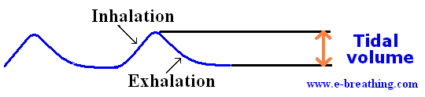

# Parámetros de Volumen

Estos parámetros se relacionan con la cantidad de aire que entra.

| Parámetro | Siglas | Unidades | Valor por defecto | Mínimo | Máximo | Incremento ±∆ |
| :- | :-: | :-: | :-: | :-: | :-: | :-: |
| Volumen Tidal | V$_T$ | mL | 500 | 200 | 1000 | 25 - 50 |
| Flujo inspiratorio | F$_{insp}$ | L/min | 60 | 40 | 80 | 10 |

## Volumen Tidal

- Su siglas son **V$_T$**.
- Es la cantidad de aire que se introduce al paciente.

## Flujo inspiratorio (Flujo)

- Su siglas son **F$_{insp}$**.
- Es la velocidad a la que se introduce aire al paciente.
